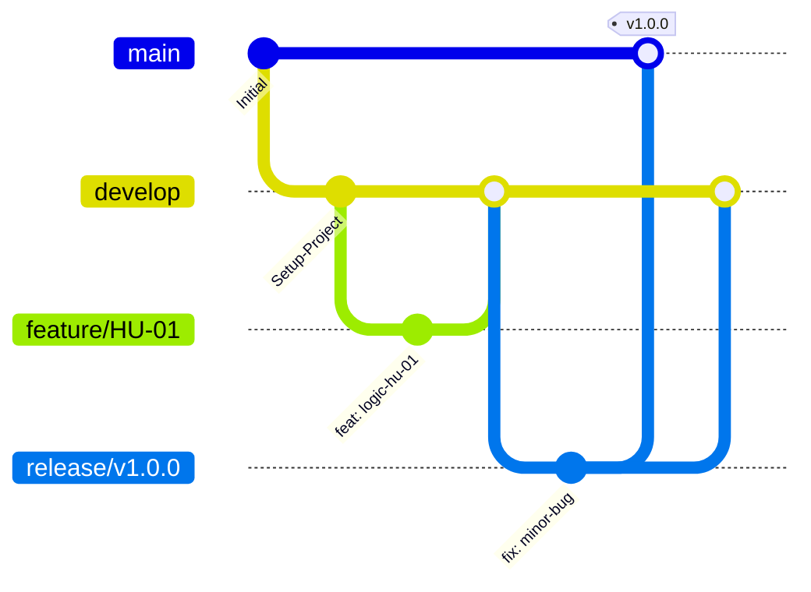

# AgroValle Connect 🌾

## 📌 Visión del Producto
> Para **productores del Valle del Cauca**,
> que **necesitan vender directo sin intermediarios**,
> AgroValle Connect es **una plataforma web desarrollada en Java 17 / Spring Boot**,
> que **conecta la oferta agrícola con la demanda comercial urbana a precio justo**,
> a diferencia de **los intermediarios tradicionales**,
> nuestro producto **garantiza trazabilidad y contratos de API transparentes**.

## 👥 Integrantes del equipo

| _Nombre 1_ | Andres Felipe Ramos |
| _Nombre 2_ | Luis Felipe Porras |
| _Nombre 3_ | Santiago Narvaez Rivera |
| _Nombre 4_ | Milton Adolfo Cortez  |


## 🌿 Estrategia de Control de Versiones: GitFlow

Elegimos **GitFlow** porque nuestro proyecto tiene entregas por sprint (lanzamientos versionados) y varios integrantes trabajando en historias distintas en paralelo. Esto nos permite mantener `main` siempre estable mientras `develop` integra el trabajo en curso, minimizando los tiempos de espera y evitando fusiones extensas de última hora, ya que cada Historia de Usuario vive en una rama `feature/` de corta duración.



## 📝 Convención de Commits
Usamos **Conventional Commits**:
- `feat:` nueva funcionalidad
- `fix:` corrección de error
- `docs:` documentación
- `test:` pruebas
- `chore:` tareas de mantenimiento

Ejemplo: `feat(api): implementar endpoint de autenticación con JWT`

## ⚙️ Stack Tecnológico
- Java 17 / Spring Boot
- PostgreSQL
- Maven
- JUnit 5 + JaCoCo (cobertura mínima 60%)
- Checkstyle (Google Java Style)
- Husky (pre-commit hooks)

## 📂 Estructura del repositorio
```
/src/main/java     → código fuente (MVC)
/src/test/java     → pruebas unitarias
/docs/dod.md       → Definition of Done
BACKLOG.md         → Product Backlog (15 HUs, MoSCoW, BDD, Story Points)
checkstyle.xml     → reglas de estilo
.gitignore
```

## ✅ Definition of Done
Ver [docs/dod.md](docs/dod.md)

## 📋 Product Backlog
Ver [BACKLOG.md](BACKLOG.md)
